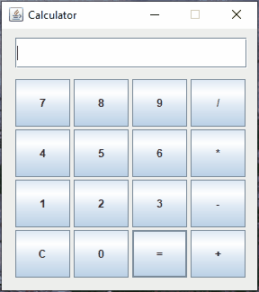
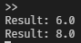

<div align="center">
	<h1>Calculator</h1>
	🤖
<h2>Information</h1>

This is a simple calculator with GUI.

<h2>Screenshots</h2>

  
<br>
	


|  |  |
| :---:   | :---: |
| You can type from the keyboard | Можно печатать с клавиатуры |
| You can enter spaces   | Можно вводить пробелы |
| You can calculate fractional numbers | Можно вычислять дробные числа   |
| You can use brackets   | Можно использовать скобки |
</div>

Windows:
 ```
 ant
 ant package
 java -jar .\build\Calculator.jar
```
